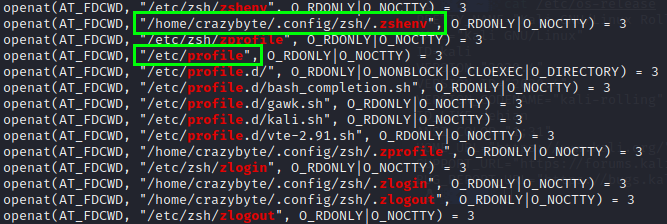
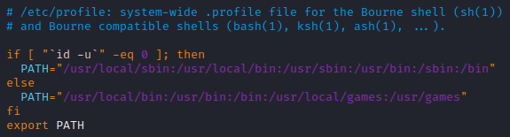

## ZSH login-shell PATH override

According to the [zsh documentation](http://zsh.sourceforge.net/Intro/intro_3.html), `PATH` should be configured in `$ZDOTDIR/.zshenv` and not in `$ZDOTDIR/.zprofile` or `$ZDOTDIR/.zlogin`.  
I noticed that on Kalilinux all the zsh login shells have `PATH` set to `/usr/local/bin:/usr/bin:/bin:/usr/local/games:/usr/games` instead my custom one. That happens because `/etc/profile` is sourced after `$ZDOTDIR/.zshenv` and it resets the PATH variable instead of extending it.

As can be seen from the following screenshot, `/etc/zprofile` is sourced after `$ZDOTDIR/.zprofile`

since `/etc/profile` in Debian, and some of its derived distro (like Kalilinux), is configured to override `PATH` regardless if it already exists

this breaks the `PATH` initialization on ZSH login-shells for users who leverage `$ZDOTDIR/.zshenv` to set it.

Simple workarounds are either move the PATH initialization from `$ZDOTDIR/.zshenv` to `$ZDOTDIR/.zprofile`, or edit the system file `/etc/profile`.